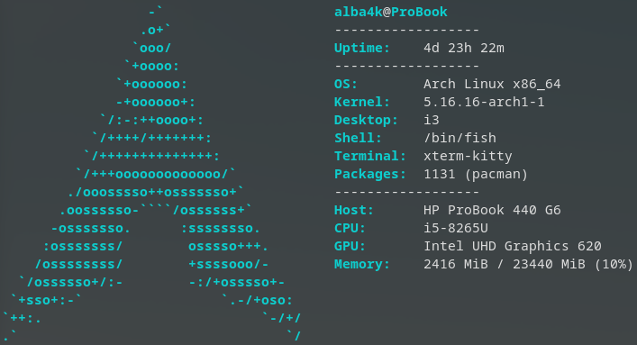

# v1.0 -> **v2.0**

## albafetch now accepts flags!
* `--help` or `-h` will print some useful info and exit
* `--color` or `-c` can be used to change the colored parts of the output
* `--bold` or `-b` can be used to toggle the bold in the colored parts of the output

## some new blocks (disabled by default):
* user - displays the name of the currently logged user
* hostname - displays the machine hostname

## other minor changes

---

### Aaron Blasko, March 2022