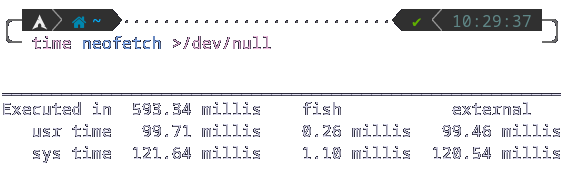
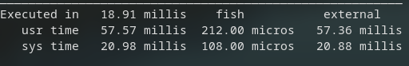

# albafetch ~by alba4k


albafetch is a simple, fast system fetching program. It prints many info about the system in way less than a second. I decided to make this as a challenge for myself and since I found neofetch too slow (which is understandable from a 10k+ lines shell script).

**It was made, and only works, on Arch Linux, due to a dependency for pacman**

Here is a time comparison (exact execution times change between machines and runs):




## Dependencies:
* whoami (username)
* pacman (packages)
* wc (packages)
* free (memory)
* grep (memory)
* awk (memory)

All of those will be present by default on a normal Arch Linux installation.

* lsb-release (getting the distro name)

lsb-release will need to be installed via `# pacman -S lsb-release`

You will be able to use this script by downloading an executable from the [releases page](https://github.com/alba4k/albafetch/releases) or by compiling it yourself. While compiling might appear more complicated, it will allow you to **customize the output**.

# Compiling:
```shell
$ git clone https://github.com/alba4k/albafetch
$ cd albafetch/
$ make
```
An executable file will appear in `albafetch/`

# Installation
```
$ git clone https://github.com/alba4k/albafetch
$ cd albafetch/
# make install
```
`make install` needs to be ran as root (e.g. using `sudo` or in a root shell) to acces `/usr/bin/`. It will compile `albafetch/src/main.c` to this directory.

# Customizing
```
$ git clone https://github.com/alba4k/albafetch
$ cd albafetch/src/ 
```
You can change some settings in `albafetch/src/config.h`, or by directly modifying the entire source code in `albafetch/src/`. You will need to recompile/reinstall after configuring.

---

### Aaron Blasko, March 2022
