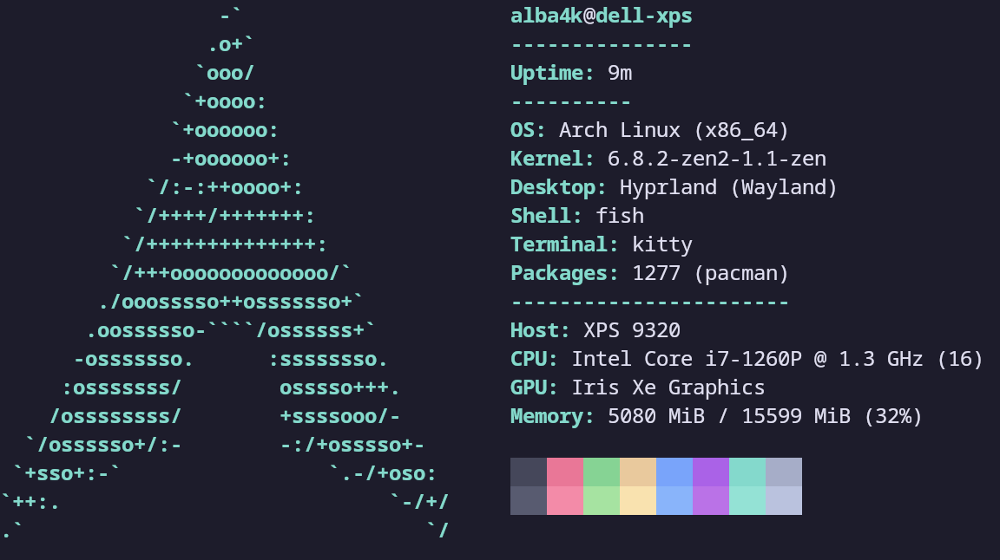
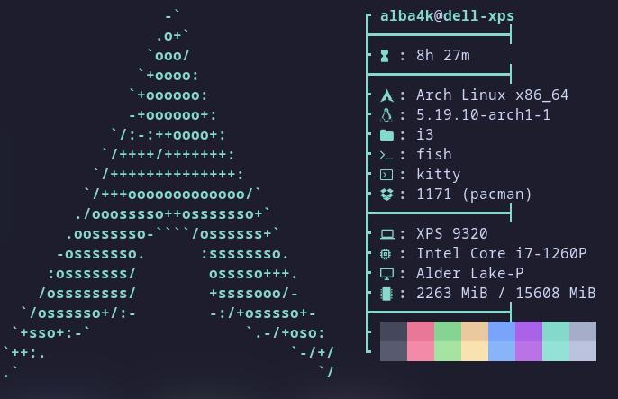

# albafetch ~by alba4k

albafetch is a simple and fast program to display a lot of system information in a neofetch-like layout in way less than a second. I decided to make this as a challenge for myself and since I found neofetch too slow (which is understandable given that we're talking about a 10k+ lines shell script). It's also often a bit faster than fastfetch too, but is way less feature-rich.

Preview

This is what albafetch will likely look like by default:

And this is what [my configuration](https://github.com/alba4k/.dotfiles/blob/master/.config/albafetch/albafetch.conf) looks like:

Here is a time comparison (exact execution times change between machines and runs)

You will find a lot of useful usage and configuration related info inside of the [wiki](https://github.com/alba4k/albafetch/wiki) and a small list of the things I changed since the last release in the [changelog](CHANGELOG.md).

It currently supports a lot of GNU/Linux distributions, macOS (both x64 and arm64 macs) and even Android (only tested in Termux).
Feel free to test any other platform :)

# Contributing

Almost everything included in this program is written in C.

If you want to, you can directly modify the source code contained in this repository and recompile the program afterwards to get some features you might want or need.

New logos can be added in [`src/logos.h`](src/logos.h) (be careful to follow the format), new infos in `src/info` and [`src/info/info.h`](src/info/info.h). Config options are mainly parsed in [`src/utils.c`](src/utils.c). You will also need to edit [`src/main.c`](src/main.c) afterwards to fully enable the new features.

Don't mind opening a pull request if you think some of the changes you made should be in the public version. Please run `clang-tidy --fix src/**/*{.c,.h}` to check for any issues and `clang-format -i src/**/*{c,h}` to make sure the code style is consistent with the rest of the project before committing.

Any contribution, even just a fix of a typo, is highly appreciated.

---

###### © Aaron Blasko

###### Initially started in March 2022
